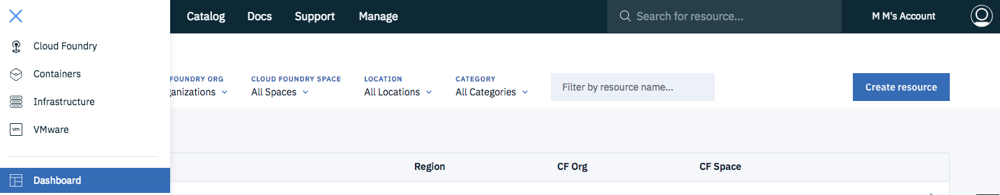
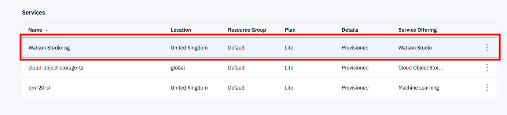
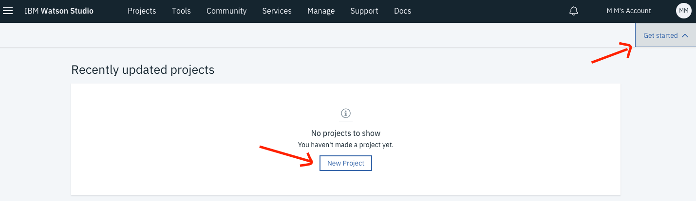
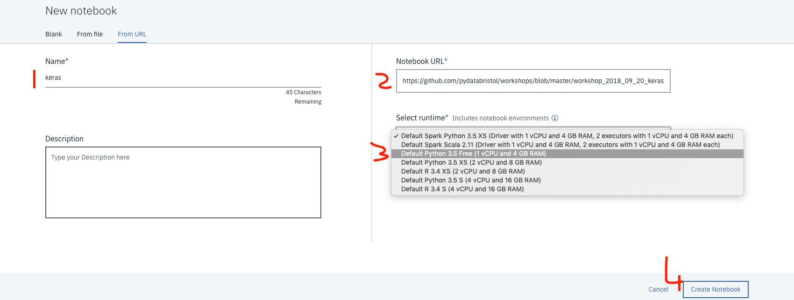

# Run Jupyter notebooks in Watson Studio

## IBM Cloud

- [Sign up](https://ibm.biz/BdZCKW) for an IBM Cloud account

- Access Watson Studio. At the top of your IBM Cloud dashboard click `Create Resource`. You can find the dashboard under the hamburger menu at the top left:

- Search for Watson Studio and click on the tile:

- Select the Lite plan and click `Create`.
- Go back to the dashboard and click on your Watson Studio service and then click `Get Started`. Alternatively, go directly to [Watson Studio](https://eu-gb.dataplatform.ibm.com):

## IBM Watson Studio

- Open [IBM Watson Studio](https://eu-gb.dataplatform.ibm.com/)
- Create a new project by clicking on `Get Started` and `New Project`. 
 
 
 
- Give your Project a name.
- Select an Object Storage from the drop-down menu or create a new one for free. This is used to store the notebooks and data. **Do not forget to click refresh when returning to the Project page.**
- click `Create`.  

-  Add a new notebook. Go to the `Assets` tab at the top of the Project page. Scroll down to `Notebooks` and click +. Choose one of these options by clicking on the tabs:
   - **Blank**: Create a new blank notebook
   - **From File**: Choose a notebook file from your computer
   - **From URL**: Choose new notebook `From URL`. Give your notebook a name and copy the URL - for instance `https://github.com/pydatabristol/workshops/blob/master/workshop_2018_09_20_keras/PyData%20Bristol%20-%20Intro%20to%20Deep%20Learning%20with%20Keras%20-%20September%202018%20-%20Solution%20code.ipynb`
 
- Select a runtime and click `Create Notebook`. 
 

 

 
 * The notebook will load. 
 
To run the notebook each code cell in the notebook needs to be executed, in order, from top to bottom.

Every code cell is selectable and is preceded by a tag in the left margin. The tagformat is `In [x]:`. Depending on the state of the notebook, the `x` can be:

1. A blank, this indicates that the cell has never been executed.
2. A number, this number represents the relative order this code step was executed.
3. A `*`, this indicates that the cell is currently executing.

To execute the code cells in your notebook select the cell, and then press the `Play` button in the toolbar.
